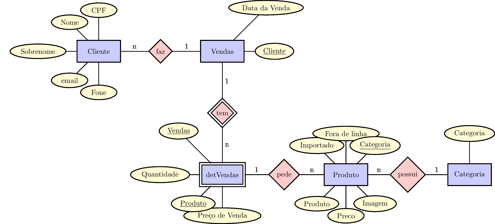
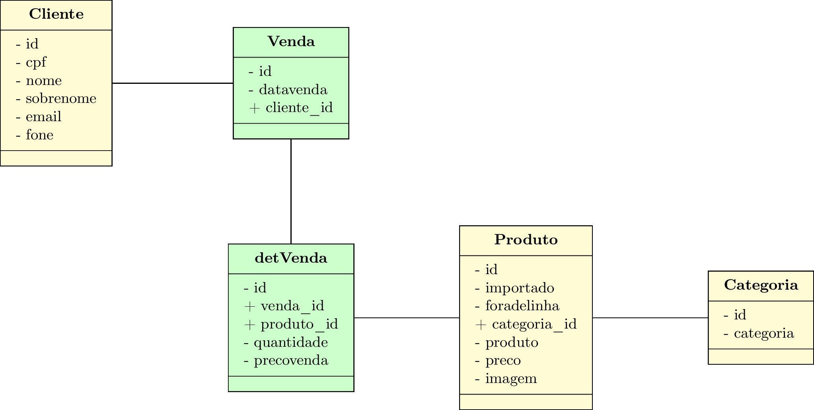

Vendas
======

Python 3.5.0 and Django 1.10.1

Veja o [live demo][13].

# Objetivo

Desenvolver uma aplicação que realize a venda de produtos.

Explorar todos os recursos do [Django][0] junto com todas as possibilidades de regras de negócio requisitadas num projeto real.

# Requisitos

- o sistema vendas gerencia produtos por categoria.
- cada produto possui: categoria, preço e imagem, além de ser importado ou não, e estar fora de linha ou não.
- cada cliente possui: CPF, nome, sobrenome, email e telefone.
- cada cliente pode fazer uma venda e cada venda pode conter vários produtos, cada um com sua quantidade e o valor total da venda.
- o sistema deve pesquisar os produtos retornando o preço e a quantidade disponível.
- o sistema deve gerar um relatório com total geral e estatísticas dos produtos mais vendidos.

Inicialmente eu quero explorar as bibliotecas do [class based views][2] como [TemplateView][3], [ListView][4] e [FormView][5].

# Baixando e rodando a app

```bash
$ git clone https://github.com/rg3915/vendas.git
cd vendas
python -m venv .venv # python3
source .venv/bin/activate
PS1="(`basename \"$VIRTUAL_ENV\"`):/\W$ " # opcional
pip install -r requirements.txt
cp contrib/env-sample .env
./manage.py makemigrations core
./manage.py migrate
./manage.py createsuperuser
./manage.py loaddata fixtures.json
./manage.py runserver
```

[http://localhost:8000/][14]


# Modelo

**mer.tex** é a modelagem conceitual (coloquei apenas as entidades). Para fazer este documento eu usei o [LaTeX][9] junto com o pacote [tikz-er2][10].

Para compilar o documento use o comando

	$ latexmk -pdf mer.tex && latexmk -c

Para converter o **pdf** em **jpg** use o [Imagemagick][11].

	$ convert -density 300 mer.pdf mer.jpg



**tabelas.tex** foi feito em [LaTeX][9] junto com o pacote [tikz-uml][12].



# Gerando dados randômicos

Para gerar dados randômicos entre na pasta ``vendas_project/dados`` e digite

```bash
$ python manager_db.py
```

## Nova api para pegar produtos do [Mercado Livre][15]

Entre na pasta `vendas/api/` e digite

```bash
python vendas/api/get_categorias.py
python vendas/api/get_produtos.py
```

Depois rode o comando

```bash
make create_categories
make create_products2
```

# Notas

Para gerar **vendas.png** use a biblioteca [django-extensions][1] junto com


	$ ./manage.py graph_models -a -g -o vendas.png

ou

	$ ./manage.py graph_models -e -g -l dot -o vendas.png vendas

Se der **erro**, instale *pyparsing* novamente desta forma:

	$ pip uninstall pyparsing
	$ pip install -Iv https://pypi.python.org/packages/source/p/pyparsing/pyparsing-1.5.7.tar.gz#md5=9be0fcdcc595199c646ab317c1d9a709
	$ pip install pydot
	$ pip freeze > requirements.txt


Leia [django-notes][8].

Veja o [live demo][13].

[0]: https://www.djangoproject.com/
[1]: http://django-extensions.readthedocs.org/en/latest/
[2]: https://docs.djangoproject.com/en/dev/ref/class-based-views/
[3]: https://docs.djangoproject.com/en/dev/ref/class-based-views/base/#templateview
[4]: https://docs.djangoproject.com/en/dev/ref/class-based-views/generic-display/#listview
[5]: https://docs.djangoproject.com/en/dev/ref/class-based-views/generic-editing/#formview
[8]: http://django-notes.blogspot.com.br/2012/07/vizualization.html
[9]: http://latexbr.blogspot.com.br/
[10]: https://bitbucket.org/pavel_calado/tikz-er2/wiki/Home
[11]: http://grandeportal.blogspot.com.br/2012/06/editando-imagens-no-imagemagick.html
[12]: http://perso.ensta-paristech.fr/~kielbasi/tikzuml/index.php?lang=en
[13]: http://rg-vendas.herokuapp.com/
[14]: http://localhost:8000/
[15]: http://bit.ly/2hjY2KB
